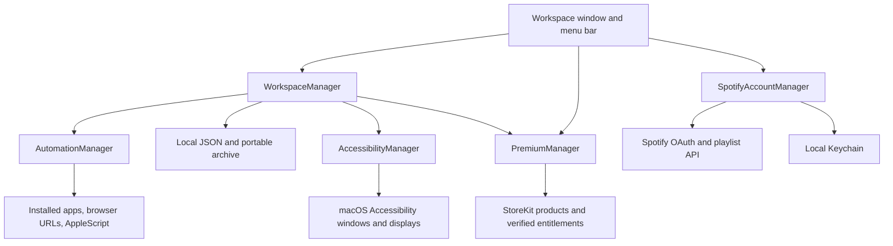

# Development and architecture

[Documentation home](README.md) · [User guide](UserGuide.md) · [Testing](Testing.md) · [Data reference](DataReference.md)

This is the contributor and owner reference for the current Deylo source, checked on 5 October 2026. Product behavior is documented in [UserGuide](UserGuide.md); provider configuration and permissions are in [Integrations](Integrations.md).

## Source checkout

The current GitHub repository contains documentation, the StoreKit configuration, and zipped Xcode project metadata. The build and test workflows below apply to the full development workspace, including its `macapp/` and `Tests/` directories. Those source directories must be supplied before this repository can be built. File references below show paths in that workspace rather than links to files that are absent here.

## Project and toolchain

| Setting | Current value |
| --- | --- |
| Xcode project | `macapp.xcodeproj` |
| Application target / run scheme | `macapp` |
| App bundle / executable / display name | `Deylo.app` / `Deylo` / `Deylo` |
| Project macOS deployment target | `27.0` |
| Verified local toolchain | Xcode 27.0, build 27A266a; Apple Swift 6.4 compiler |
| Swift language mode | Swift 5 (`SWIFT_VERSION = 5.0`), not Swift 6 language mode |
| Default isolation | MainActor; approachable concurrency enabled in the app target |
| Version / build | 1.0 / 1 |
| Platforms | macOS |
| Dependencies | Apple system frameworks; no package manager or third-party runtime dependency is declared |
| Signing style | Automatic; the owner must select the appropriate team for distribution |
| Hardened runtime | Enabled |
| App Sandbox | Disabled in the committed Debug and Release target settings |
| Selected-file access | Xcode setting `readwrite`; file panels use security-scoped access when available |

The deployment target is a repository configuration fact. Earlier macOS versions are not claimed to be supported by this build. Lowering it is a compatibility change that requires API-availability review and testing; it is not a documentation-only edit.

Sources use SwiftUI, AppKit, Foundation, Combine, CoreGraphics, ApplicationServices, AuthenticationServices, CryptoKit, Security, LocalAuthentication, StoreKit, and Darwin. There is no server process, database server, Electron bundle, embedded web frontend, or shipped command-line interface.

### Open and run

Open `macapp.xcodeproj` in Xcode, select the `macapp` scheme and the local Mac destination, and run. In Signing & Capabilities, use an appropriate development signing identity if your environment requires one. Xcode builds the application as Deylo even though the project and scheme retain the historical `macapp` name.

From the project root, equivalent build commands are:

```sh
xcodebuild -project macapp.xcodeproj -scheme macapp -configuration Debug -destination 'platform=macOS' -derivedDataPath /tmp/deylo-debug-build build
xcodebuild -project macapp.xcodeproj -scheme macapp -configuration Release -destination 'platform=macOS' -derivedDataPath /tmp/deylo-release-build build
```

These examples use separate DerivedData directories. The resulting bundles are under `Build/Products/Debug/Deylo.app` and `Build/Products/Release/Deylo.app` respectively. Signing and SDK selection depend on the active Xcode configuration. Build errors about signing require local Xcode/team setup, not disabling validation in the app.

Run the isolated backend suite with:

```sh
bash Tests/run-backend-tests.sh debug
bash Tests/run-backend-tests.sh release
```

The runner is independent of Xcode's app scheme. See [Testing](Testing.md) for coverage, fixture isolation, and the distinction between its Release mode and a production app build.

## Source map

| File | Responsibility |
| --- | --- |
| `macapp/MyApp.swift` | App entry point; shared manager ownership; environment objects; workspace and Pro windows; Workspace commands; menu bar extra; scheduler lifecycle |
| `macapp/Brand.swift` | Deylo identity, vector mark, accent, cards/headings/notices, placement previews, shared visual components |
| `macapp/ContentView.swift` | Sidebar/detail UI; app catalog/picker; workspace CRUD; settings; recovery panels; file panels/review; permissions; native placement test |
| `macapp/ProViews.swift` | Upgrade/ownership UI, feature-gate presentation, schedule/sequence settings, import review |
| `macapp/Models.swift` | Codable workspace/app models, recognized-browser capabilities, placement values, structural data validation |
| `macapp/WorkspaceManager.swift` | Persistence and rollback; editing; launch orchestration; feature gates; schedules; import/export/copy; layout recording/test; permission state |
| `macapp/WorkspaceSchedule.swift` | Local repeating schedule, wall-clock minute identity, delayed-launch scheduling abstraction |
| `macapp/WorkspaceArchive.swift` | Portable wrapper/version/limits; bounded nonblocking regular-file reader |
| `macapp/AutomationManager.swift` | Installed-app resolution/opening, selected-browser URL delivery, Spotify playlist/autoplay, iTerm script execution, integration validation |
| `macapp/AccessibilityManager.swift` | Accessibility permission, usable-window selection, geometry conversion, placement operation, retries/readback, connected-display validation |
| `macapp/SpotifyAccountManager.swift` | OAuth PKCE and callback validation, web-auth session, HTTP requests, refresh credentials, Keychain, playlist pagination, account lifecycle |
| `macapp/PremiumManager.swift` | StoreKit adapter, verified entitlement state, transaction listener, purchase/restore, refund/race handling, Debug preview |
| `macapp/AppErrorMessage.swift` | Contextual safe error translation and bounded recovery details |
| `macapp/macapp.entitlements` | Network-client and Apple-event entitlements declared by the project |
| `macapp/Assets.xcassets/Contents.json` | Deylo icon and accent assets |
| [Deylo.storekit](../Deylo.storekit) | Explicit local StoreKit test configuration; outside the app's synchronized resource directory |
| `Tests/run-backend-tests.sh` | Directly compiled isolated regression executable and runner |

The Xcode project uses a filesystem-synchronized root group for `macapp`. New app source/resources placed there join the app target through that group. Documentation, tests, and the root StoreKit configuration remain outside it. Verify target membership and actual packaged resources after adding files.

## Runtime ownership and state

`MyApp` creates one `PremiumManager` and supplies it to one `WorkspaceManager` as `PremiumAccessProviding`. The Spotify account object uses the shared account manager. The main window and menu bar use these same objects; they do not maintain separate workspace copies. SwiftUI observes published state through environment objects and observed objects.

The workspace manager loads data during initialization. The main content's appearance starts scheduling explicitly. Manager initialization in a test does not create a timer. Startup uses a 15-second repeating timer in the main run loop's common modes and an `NSWorkspace.didWakeNotification` observer. Stop invalidates the timer, removes the observer, and changes the schedule generation so queued work cannot resume. The menu-bar Quit command stops scheduling before termination. Destruction also invalidates timer/observer resources.

Persistent state is configuration, not runtime activity. Selection, launch progress, errors, schedule-consumption tracking, and preview ownership are not serialized. Managers run on MainActor; independent validation and error helpers explicitly use nonisolated entry points where required.



### UI edit and file-operation boundaries

The root sheet captures its intended workspace/app context. Changing the selected workspace does not redirect a pending edit to another workspace. Saving, placement tests, and file panels each guard duplicate actions. Workspace mutations are blocked during a launch or placement test, and backend guards remain authoritative even if a UI control is accidentally enabled.

Import/export use native panels presented asynchronously, rather than a blocking modal loop. A single active panel is retained at a time. Selected URLs use security-scoped access around the file operation. A portable import is decoded for review before it is committed; reviewing never opens applications or executes commands.

## Launch pipeline

1. Validate the workspace structure and reject an empty setup with a useful status.
2. If any app requests positioning, preflight Accessibility access before launching any entry.
3. Capture the workspace configuration, start a fresh launch generation, and publish busy/cancellable state.
4. Resolve/open each installed app by bundle identifier.
5. Deliver its optional browser website, Spotify playlist/autoplay, or iTerm command.
6. Apply placement even when an optional integration reports a failure, so a website or playback failure does not unnecessarily discard the layout operation.
7. Finish each entry once and publish success or bounded per-app error details.

Concurrent launches start every entry independently. With premium access and `launchInOrder == true`, entries run in display order. Each entry's optional delay occurs before opening that entry. The next entry follows the previous entry's integration/layout completion, including failure. A missing app does not abort the remaining workspace. Synchronous failures drain iteratively so a large sequence cannot overflow the stack.

One-shot wrappers at service and manager boundaries reject repeated callbacks. A generation UUID rejects callbacks and delayed sequence work after cancellation. Entry UUID tracking prevents an app completion from decrementing the outstanding count twice. Launch details retain the first ten app errors and summarize any remainder.

Stop changes the generation and clears launch state. It prevents remaining sequence entries and stale callbacks from starting work. It does not close apps already opened or undo side effects already dispatched to another application. There is no external cancellation protocol for an in-flight `NSWorkspace` open or Accessibility write.

Ordered-launch status does not mean a shell command's server is ready or that browser content has finished loading. iTerm script completion means the command was submitted. Delays are fixed waits. Deylo has no service health polling or dependency graph.

## Schedule evaluation

`WorkspaceSchedule` validates hour, minute, and Calendar weekdays. Evaluation uses current local calendar/timezone and compares wall-clock minutes. Its in-memory consumed-minute map prevents replay during a repeated daylight-saving minute. A clock high-water mark avoids replay after backward time changes.

Startup/wake consumes the current due minute without launching it. Evaluation gaps over 90 seconds similarly pause that minute. All due workspaces are marked consumed before gating on storage readability, premium access, or busy state. Only the first due workspace in saved order is launched. Others are skipped, with no catch-up queue. Configure different minutes for setups that should each run.

Schedules require the app running and the Mac awake. They do not register a system launch agent, wake the Mac, or start Deylo at login. Consumption is not persisted across processes; the scheduler is not a cross-process exactly-once job system.

## Persistence, migration, and archives

Local configuration is a JSON array, with optional fields preserving older valid files. The selected path prefers a prior container file for the same app identity. Local saves validate the whole array, enforce a 16 MiB bound, compare previously loaded bytes against the file before writing, and write atomically. UI edits roll back if persistence fails. Unreadable/corrupt files are retained and blocked from overwrite. This is not a file-locking or multi-writer storage engine.

The reader uses `O_RDONLY | O_NONBLOCK | O_NOFOLLOW | O_CLOEXEC`, validates the actual descriptor with `fstat`, requires a regular file, and checks both the declared size and bounded read. It avoids pipe blocking and filename preflight races. Storage and import share this reader with different size limits.

The one-workspace archive has marker `deylo.workspace`, version 1, maximum 1 MiB, and at most 100 apps. Export validates integration settings. Import previews/normalizes, disables its schedule, generates fresh identities on confirmation, and persists an independent copy. It never restores credentials or ownership. The full model, limits, and examples are in [DataReference](DataReference.md).

## Integration boundaries and injection

| Abstraction | Native implementation / consumer |
| --- | --- |
| `ApplicationOpening` | `NativeApplicationOpener` resolves/opens installed apps and URLs through NSWorkspace; injected into `AutomationManager` |
| `AppleScriptExecuting` | `NativeAppleScriptExecutor`; injected into `AutomationManager` |
| `WindowLayoutManaging` | `AccessibilityManager`; injected into `WorkspaceManager` |
| `WindowAccessibilityAdapting` / `WindowAccessibilityWindow` | Native AX adapter/window wrappers; injectable permission, screens, window selection/read/write |
| `WindowPlacementScheduling` | Main-queue scheduler; injectable placement retry clock/actions |
| `WorkspaceLaunchScheduling` | `NativeWorkspaceLaunchScheduler`; injectable sequence-delay actions |
| `PremiumAccessProviding` | `PremiumManager`; injectable free/paid access for workspace tests |
| `PremiumStoreClient` | `StoreKitPremiumStore`; injectable products, entitlements, updates, purchase, sync, finish |
| `SpotifyHTTPClient` | Native bounded HTTP client; injectable API/token responses |
| `SpotifyCredentialStoring` | Keychain credential adapter; injectable credential storage |
| `SpotifyAuthenticating` | `ASWebAuthenticationSession` adapter; injectable callback/cancellation |
| `SpotifyClientIDStoring` | UserDefaults adapter; injectable client-ID preferences |

Tests supply storage URLs and clocks rather than touching user data. Application opening and AppleScript interfaces keep scripts and URLs inspectable without executing them. Window placement tests can advance retries deterministically and simulate mid-operation screen changes. Spotify generation checks discard authentication/network results after disconnect or a client change. StoreKit entitlement revisions prevent old queries or purchase results from overriding newer ownership.

### Workspace manager entry points

| Area | Methods |
| --- | --- |
| Workspaces | `addWorkspace`, `renameWorkspace`, `duplicateWorkspace`, `removeWorkspace` |
| Apps | `addAppToWorkspace`, `updateAppInWorkspace`, `removeApp`, `moveApp` |
| Paid configuration | `setSchedule`, `updateLaunchOptions` |
| Files | `exportWorkspace`, `previewImport`, `importWorkspace`, `saveWorkspaces`, `loadWorkspaces` |
| Launching | `launchWorkspace`, `cancelLaunch` |
| Windows | `checkWindowAccess`, `openWindowAccessSettings`, `testWindowPlacement`, `recordLayout` |
| Scheduling | `startScheduling`, `stopScheduling`, `pauseScheduleEvaluation`, `evaluateSchedules` |

These are internal Swift APIs, not a public SDK or remote API contract. Keep validation and feature gates in the manager when adding new UI actions; a view-only gate is insufficient.

## App identity and branding

Brand name/tagline/visual components are centralized in `Brand.swift`; assets and product/display names use Deylo. The historical bundle suffix `.macapp` remains deliberate. Preserve the existing bundle identifier when updating this installation so workspace lookup and system/account associations continue to target the same app.

The Spotify redirect remains `macapp-spotify-auth://callback`; changing the visible name does not imply changing the OAuth redirect. The current source does not add a `CFBundleURLTypes` registration. Authentication is handled by `ASWebAuthenticationSession` with the supplied callback scheme. See [Integrations](Integrations.md) before altering it.

Rebuilding or moving an ad-hoc app can cause macOS to retain permission for a previous executable identity. Refresh only the intended current app's entry in System Settings, then reopen its settings/check access. A permission toggle shown as enabled is not sufficient evidence until the running process reports trusted access. Distribution signing and permission continuity need validation on the actual shipped artifact.

## Premium and owner configuration

The only implemented paid product is non-consumable `com.deylo.pro.lifetime`. Ownership requires an active verified transaction for that exact product and type. Product loading and entitlement loading are separate, so catalog failure does not invent or erase an otherwise verified entitlement. Updates reconcile the authoritative current entitlement set; refunds/revocations remove access. Restore explicitly asks StoreKit to sync before checking again.

`hasPremiumAccess` is verified ownership or the development preview. Debug's **Workspace → Preview Pro Features (Development)** is memory-only, labeled, and reset on restart. Release's preview getter is always false and its setter cannot grant access. It is not a licensing mechanism.

Without access, schedules are consumed but not run; manual launches use concurrent behavior; new paid settings/import/export are gated. Existing saved delays can be retained while other settings are edited. The UI permits clearing a delay, disabling sequence, and removing a schedule. The backend also permits saving a disabled schedule without access, but the current schedule sheet disables its toggle and Save action without Pro; use Remove Schedule in that UI.

The local `Deylo.storekit` file proposes €24.99 once with storefront LTU. It must be explicitly selected in Xcode scheme Options for local transactions and is not automatically selected or packaged as a license. The production UI displays StoreKit's localized price when a valid product exists. No external payment processor, receipt backend, subscription product, or alternative license-key flow is implemented. [Commerce](Commerce.md) gives purchase setup and local testing instructions.

## Distribution readiness and release workflow

The current build is a desktop utility under development. Compiling and verifying a signature do not establish App Store availability, permission compatibility, notarization, or a live paid product.

The committed target has App Sandbox disabled. Apple requires sandboxing for Mac App Store submissions. Before choosing that channel, validate that Deylo's cross-application window control and Apple-event integrations can operate under the required capabilities and review constraints. The current source is not evidence that this question is resolved. [Apple's App Sandbox configuration documentation](https://developer.apple.com/documentation/xcode/configuring-the-macos-app-sandbox).

For direct distribution, prepare the owner's Developer ID signing, hardened-runtime settings, distribution package, and notarization. Direct distribution does not itself make this App Store purchase product available; the purchase/distribution design must be settled for the chosen channel. [Apple's notarization documentation](https://developer.apple.com/documentation/security/notarizing-macos-software-before-distribution).

A release review should include:

1. Choose the distribution/signing identity and retain or deliberately migrate the app's identifiers and saved data.
2. Confirm the deployment target and supported environments with actual native checks.
3. Configure the Spotify app/client/redirect and authorized test users for the intended audience; do not embed a client secret in this desktop client.
4. Configure the exact StoreKit product, final localized pricing/availability, owner agreements, and review materials when using the App Store purchase flow.
5. Run both backend configurations and compile the actual Release target. Check the resulting product identity, signature, entitlements, and resource membership.
6. Ensure a production run has no local StoreKit configuration selected and no Debug preview.
7. Perform native file, OAuth, autoplay, display, permission, schedule, and restore/refund acceptance checks with representative release signing.
8. Prepare accurate support/privacy information, screenshots, version/build values, release notes, and owner contact details for the distribution channel. The repository does not provide a finished public listing or support endpoint.
9. Archive/export, submit/notarize as appropriate, and validate the delivered artifact rather than only Xcode's development copy.

The public product price, owner distribution setup, live purchase availability, and public support contact are not finalized in this repository. Do not describe the proposed local price or successful mock transactions as a launched paid offering.

## Maintaining the code and documentation

When adding a capability, define its model defaults and validation first, route side effects through an injectable adapter, preserve generation/one-shot behavior, and expose recovery through the shared error mapper. Changes to archives need explicit version/compatibility decisions. New scheduled behavior needs sleep/wake/clock/entitlement/busy semantics, not just a timer callback.

Update the relevant user and technical chapters with the code. Record reproduced bugs and dated verification in [Hardening](Hardening.md), rather than mixing a historical assertion count into evergreen feature promises. Keep provider requirements linked to primary documentation and distinguish source behavior from verified native evidence.
